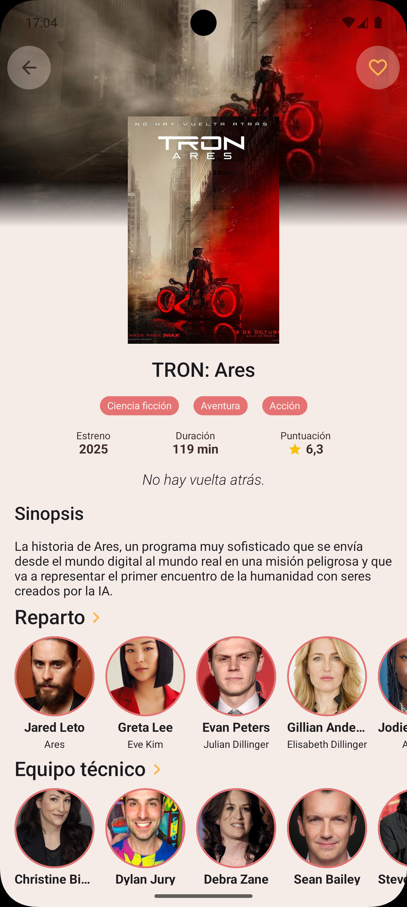
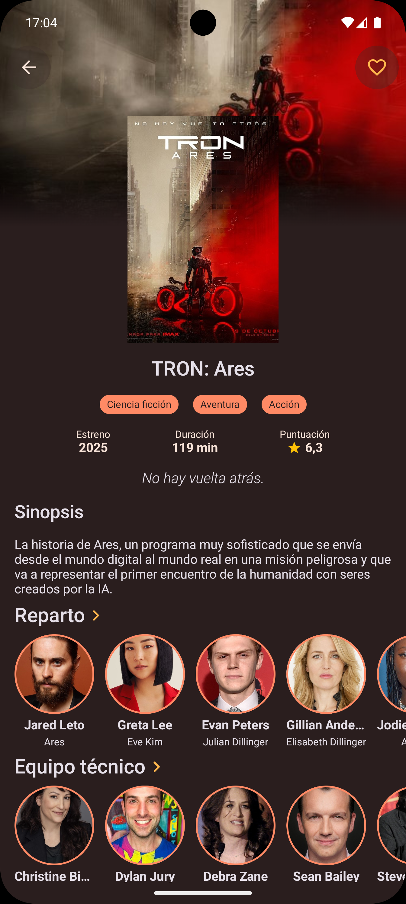

# 🎬 Películas — Android App

**Películas** es una aplicación Android desarrollada como proyecto personal y de referencia técnica.  
Permite explorar películas populares, en tendencia, próximas y actualmente en cartelera, así como ver detalles, reparto, equipo técnico y marcar películas como favoritas.

La app utiliza **The Movie Database (TMDB)** como fuente de datos e implementa una arquitectura moderna, escalable y mantenible.

---

## ✨ Características principales

- 🔍 **Explorar películas** por categorías: Trending, Popular, Now Playing, Upcoming.  
- ⭐ **Favoritos**, almacenados localmente con DataStore.  
- 🎭 **Detalle de película** completo: sinopsis, géneros, reparto, equipo técnico, puntuación, duración, fecha de estreno…  
- 👤 **Detalle de persona** (actor o miembro del equipo).  
- 📱 **Interfaz moderna** hecha completamente en **Jetpack Compose**.  
- 🎨 **Modo claro y oscuro**, adaptado a Material 3.  
- ⚡ **Arquitectura limpia (Clean Architecture)** bien organizada.  
- 🗂️ **Inyección de dependencias** con Koin.  
- 🖼️ **Carga de imágenes optimizada** con Coil.  
- 💾 **DataStore** para persistencia de favoritos.  
- 🌐 Consumo de API REST con Ktor + TMDB.

---

## 🧱 Tecnologías y Librerías

| Categoría | Tecnologías |
|------|-------------|
| **UI** | Jetpack Compose, Material 3, Coil |
| **Arquitectura** | Clean Architecture, Use Cases, StateFlow |
| **Networking** | Ktor Client, TMDB API |
| **Persistencia** | DataStore Preferences |
| **Inyección de dependencias** | Koin |
| **Otros** | Coroutines, StateFlow, Navigation Compose |

---

## 🌗 Modo claro y oscuro

La aplicación soporta **tema claro y oscuro**, con colores personalizados y diseño consistente en ambos.

---

## 📸 Capturas

### 🏠 Pantalla principal
<p float="left">
  
  
</p>

### 🎬 Detalle de película
<p float="left">
  
  
</p>

### 👤 Detalle de actor / actriz
<p float="left">
  
  
</p>

---

## 🏗️ Arquitectura

La app sigue el patrón **Clean Architecture**, dividido en:

```
movies/
│
├── data/
│   ├── model/           # DTOs desde la API (Movie, Cast, Crew…)
│   ├── mapper/          # Mappers DTO → Domain
│   ├── cache/           # Caché en memoria
│   ├── repository/      # Repositorios remotos (API) y locales (DataStore)
│   └── network/         # Api services, HttpClient
│
├── domain/
│   └── usecase/         # Lógica de negocio
│
├── ui/
│   ├── screens/         # Pantallas de Compose
│   ├── components/      # Componentes reutilizables
│   ├── navigation/      # Navegación (Routes, NavHost)
│   └── theme/           # Tema, colores y tipografía
│
├── di/                  # Módulos de Koin
└── utils/               # Helpers, formatters, constants
```

Ventajas:

- Código escalable y fácil de testear.  
- Separación clara de responsabilidades.  
- Independencia de framework en la capa de dominio.

---

## 🔌 Configurar la API de TMDB

Para utilizar la app necesitas una API Key gratuita:

👉 https://www.themoviedb.org/

Crea un archivo `local.properties` en la raíz del proyecto:

```
TMDB_API_KEY=TU_API_KEY_AQUI
```

---

## ▶️ Ejecución

1. Clona el repositorio  
2. Abre el proyecto con Android Studio  
3. Añade tu API Key a `local.properties`  
4. Ejecuta la aplicación 🚀  

---

## 📄 Licencia

Proyecto personal con fines educativos.  
Puedes usarlo como referencia o para aprender.

---

## 👨‍💻 Autor

Desarrollado por **Jose Manuel Yébenes**.
